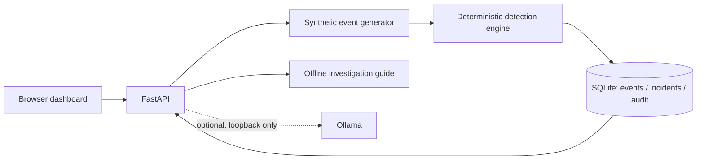

# AI SOC Analyst

**A local security operations lab that turns synthetic telemetry into explainable, evidence-backed investigations.**

Built by **Pablo Murillo** · v0.1.0 · Python / FastAPI / SQLite / MITRE ATT&CK

AI SOC Analyst demonstrates the complete analyst workflow: generate telemetry, detect suspicious behavior, prioritize an incident, inspect evidence, investigate alternative explanations, and record a decision. It runs natively on Apple Silicon with one command and no API keys.

## Run locally

Requires **Python 3.11+**. Developed and tested on macOS ARM64 with Python 3.13. The first run downloads pinned Python dependencies; subsequent runs use the local virtual environment.

```bash
bash scripts/start.sh
```

Open **http://127.0.0.1:8000**. The first launch seeds 10 synthetic events and 3 incidents. Stop with `Ctrl+C`; SQLite preserves your decisions across restarts. No Node build, paid service, or cloud account is required.

Alternative: `make run`.

## What you can do

- **Operations dashboard:** persisted event counts, active incidents, critical priorities, and implemented ATT&CK coverage.
- **Incident queue:** search by host, user, rule, or incident; filter severity and status.
- **Evidence workspace:** inspect timestamped raw records, detection rationale, false-positive context, and suggested response steps.
- **Analyst workflow:** move incidents between open, investigating, and resolved; preserve notes in an append-only application audit trail.
- **Safe simulation lab:** generate password-guessing, encoded PowerShell, cloud-upload, or benign-control records.
- **Investigation assistant:** use the offline evidence guide or opt into local generative AI through Ollama.
- **Developer API:** FastAPI endpoints, generated OpenAPI schema, automated tests, and a CI workflow.

> This is a portfolio lab, not an endpoint protection product or production SIEM. All telemetry is synthetic. No attack payloads, scans, containment commands, or file transfers are executed.

## A two-minute recruiter walkthrough

1. Open **Operations overview** and explain how events become incidents.
2. Open **Large cloud storage upload**. Show the 240 MiB event, affected asset, rule threshold, and ATT&CK mapping.
3. Ask **False positives** to demonstrate the distinction between a rule match and confirmed compromise.
4. Ask **Next steps**, then set the incident to **Investigating** and save a short rationale.
5. Run **Benign baseline** in the simulation lab: event volume rises without an alert.
6. Run **Password guessing** and inspect the five-event, five-minute correlation window.

The project demonstrates detection engineering, API design, relational persistence, defensive UI handling, evidence-led triage, and responsible AI integration. It does not claim measured enterprise detection accuracy or production performance.

## Detection catalog

| Rule | Logic | Severity | MITRE ATT&CK |
|---|---|---|---|
| AUTH-001 | ≥5 failed sign-ins for the same host, user, and source IP within 300 seconds | High | [T1110.001 — Password Guessing](https://attack.mitre.org/techniques/T1110/001/) |
| EXEC-002 | PowerShell / pwsh process with a recognized encoded-command flag | High | [T1059.001 — PowerShell](https://attack.mitre.org/techniques/T1059/001/) |
| EXFIL-003 | ≥100 MiB in a single cloud-storage upload event | Critical | [T1567.002 — Exfiltration to Cloud Storage](https://attack.mitre.org/techniques/T1567/002/) |

These are intentionally narrow demonstration rules. See [detection design and limitations](docs/DETECTIONS.md).

## AI modes

**Default: offline.** The assistant uses rule-specific templates grounded in the incident evidence. It is deterministic and explicitly labeled; it is not an LLM and does not provide unrestricted conversational reasoning.

**Optional: local Ollama.** Install Ollama from its official distribution, start it, and download a model appropriate for your Mac's available memory:

```bash
ollama pull llama3.2:3b
cp .env.example .env
```

Set `AI_PROVIDER=ollama` in `.env`, then restart the app. `OLLAMA_MODEL` can select another installed model. Requests go only to `http://127.0.0.1:11434/api/chat`. No API key or external AI service is used. Treat generated answers as analyst suggestions and verify claims against evidence; the model cannot execute actions. If Ollama is unavailable, the interface reports an error rather than pretending a model answered. Switch back to `AI_PROVIDER=offline` to use the guide.

The native Mac startup path supports this integration. The supplied Docker configuration intentionally uses offline mode because container loopback does not reach the Mac's Ollama service.

## Docker

Requires a running Docker engine. The image uses Python's multi-architecture base and does not force x86 emulation.

```bash
docker compose up --build
```

Open the same local URL. Stop the native server first to free port 8000. Docker publishes only to `127.0.0.1`, runs as a non-root user, drops Linux capabilities, and persists SQLite in the `soc-data` named volume. `docker compose down` stops the app without removing that volume.

## Tests

After the first startup installs dependencies:

```bash
make test
```

Tests cover positive and negative detections, exact window/volume boundaries, identity separation, API validation, evidence references, status/audit persistence, seeding once, concurrent SQLite writes, origin/host restrictions, and sanitized AI failures. CI tests Python 3.11 and 3.13. [Validation record](docs/VALIDATION.md) distinguishes completed checks from untested integrations.

## Architecture



A simulation is persisted atomically: run → raw events → detected incidents → audit entries. The engine is a pure function and can be tested independently of HTTP and storage. The frontend is dependency-free HTML, CSS, and JavaScript served by FastAPI, keeping local setup small and reproducible.

```text
app/
  main.py           API, application lifecycle, local request boundaries
  engine.py         Detection logic and ATT&CK metadata
  simulations.py    Inert synthetic fixtures
  db.py             SQLite schema and transaction helpers
  investigation.py  Offline guide and optional Ollama adapter
  static/           Responsive dashboard
scripts/start.sh     One-command native startup
tests/               Automated behavior tests
docs/                Architecture, detections, demo and validation notes
```

## API

| Method | Endpoint | Purpose |
|---|---|---|
| GET | `/api/health` | Readiness and selected AI provider |
| GET | `/api/overview` | Metrics, latest 500 incidents, rules and scenarios |
| GET | `/api/incidents/{id}` | Evidence, rule and audit history |
| PATCH | `/api/incidents/{id}` | Save status and analyst note |
| POST | `/api/simulations` | Generate a named synthetic scenario |
| POST | `/api/incidents/{id}/investigate` | Ask the investigation assistant |

OpenAPI JSON: `/openapi.json`. Interactive docs: `/docs`.

## Security and scope

- Local single-user lab; no authentication or role-based access. Do not expose it to the public internet or bind it to a shared interface.
- Native startup binds loopback; allowed hosts and same-origin write checks reduce browser-origin abuse.
- SQL uses parameters. UI evidence, notes, and model output are displayed as escaped text.
- `.env`, databases, virtual environments, and key files are excluded from Git; the Docker context is allowlisted.
- Audit records are application append-only, not tamper-evident. A local database owner can modify them.
- Correlation is within a simulation batch; there is no real log collector, cross-run correlation, background monitoring, or automatic remediation.
- The queue returns the latest 500 incidents. Metrics count the full database.
- No main portfolio files or repository are part of this project.

See [architecture and trust boundaries](docs/ARCHITECTURE.md) for implementation details and [SECURITY.md](SECURITY.md) for reporting guidance.

## Roadmap

Future work: validated log import, configurable rules, streaming correlation, analyst identity, durable AI conversation history, evaluation datasets, and tamper-evident audit storage. These are not shipped in v0.1.

## License

[MIT](LICENSE). MITRE ATT&CK names and identifiers belong to their respective owners; the mappings are references, not an endorsement.
